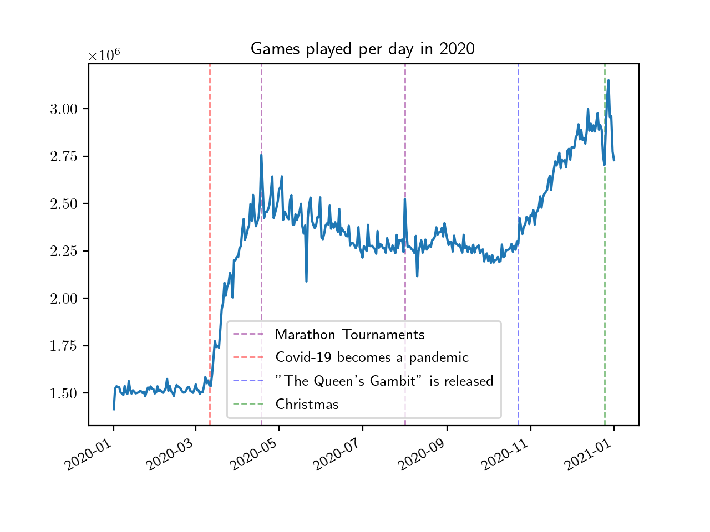
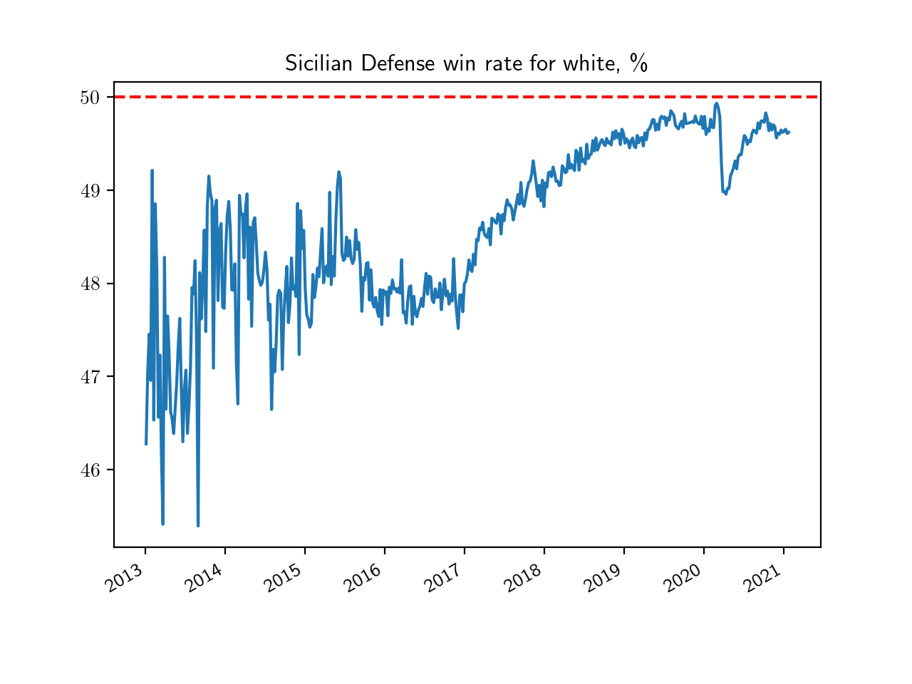

This repository was created to visualize the popularity and win rate of different chess openings over time. The [lichess database](https://database.lichess.org/#standard_games) was used.
## General popularity of Lichess in terms of the number of games played per day

It seems that usually, the main inflow happens in winters. Some spikes in the number of games played per day are associated with Marathon Tournaments.

2020 was an unusual year. The number of games played per day increased quite a lot during the pandemic and after the release of "The Queen's Gambit" series. Weekly oscillations are also distinguishable. I still can't explain a spike on May 21st.
## Openings
### The Sicilian

