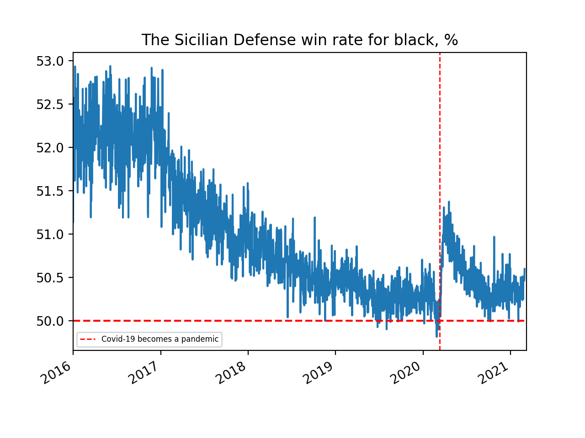
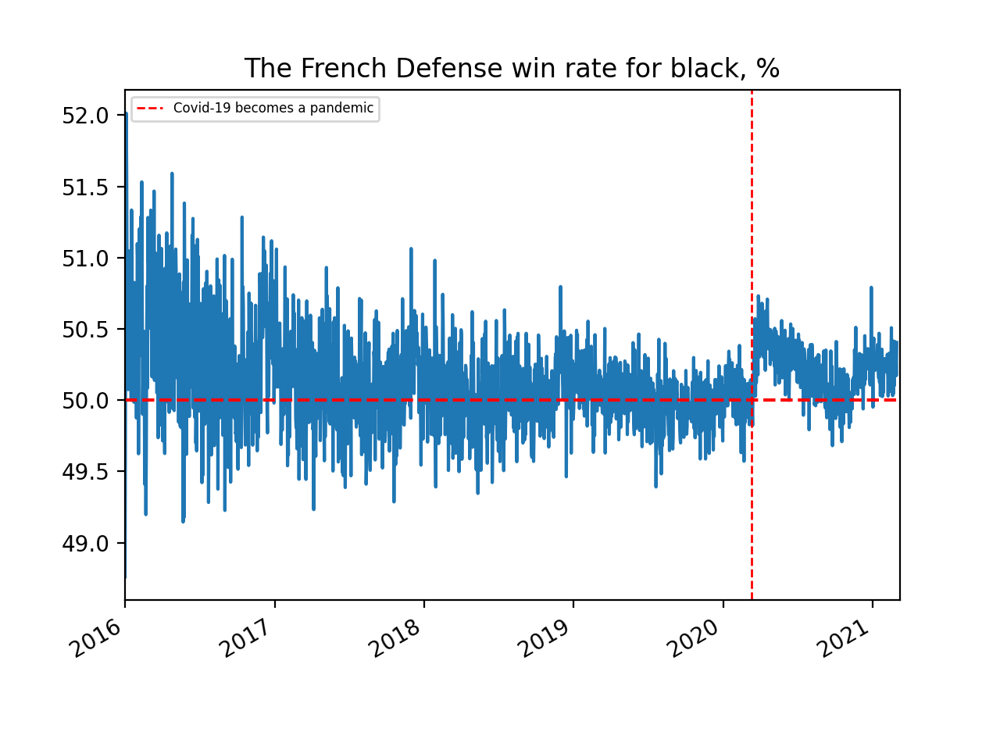
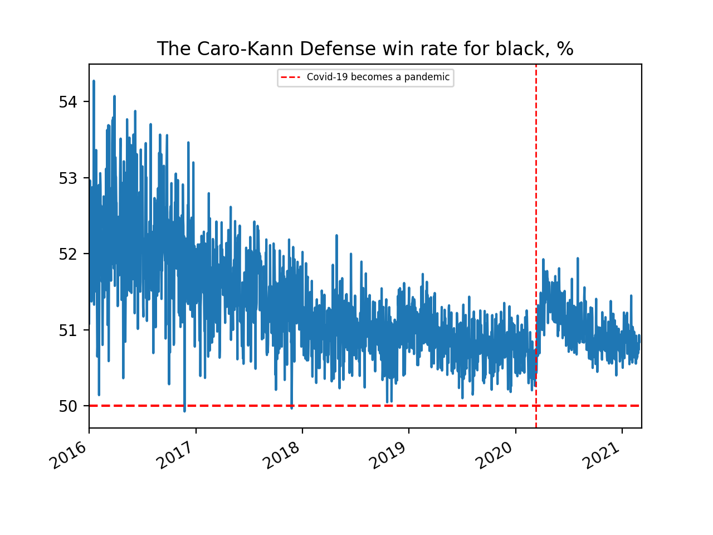
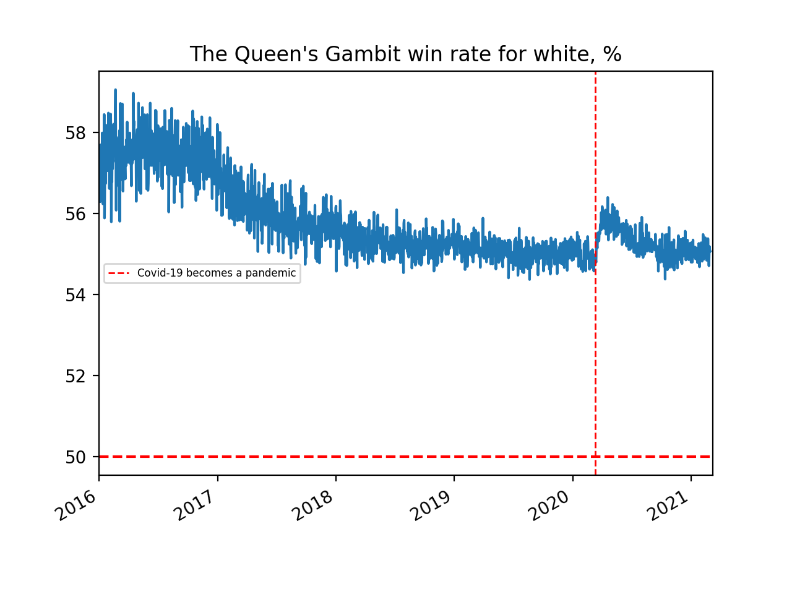
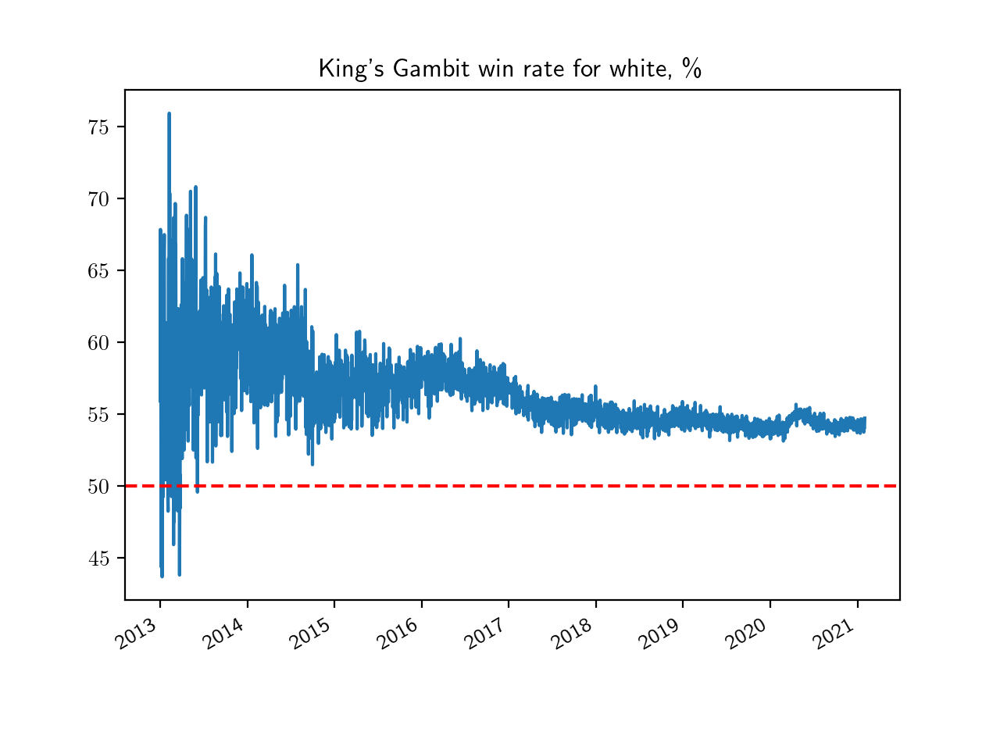
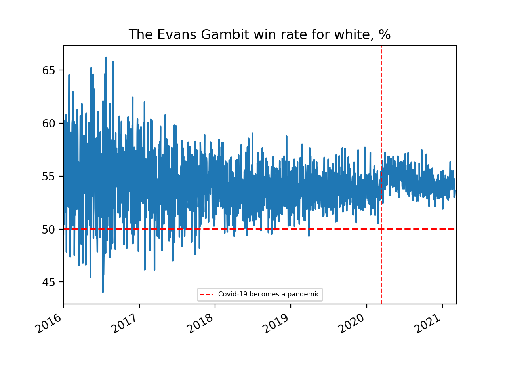
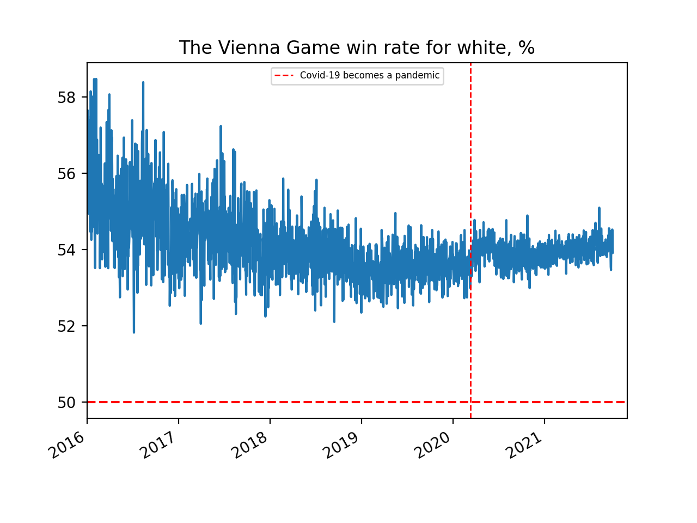

This repository was created to visualize the popularity and win rate of different chess openings over time. The [lichess database](https://database.lichess.org/#standard_games) was used.
## General popularity of Lichess in terms of the number of games played per day

It seems that usually, the main inflow happens in winters. Some spikes in the number of games played per day are associated with Marathon Tournaments.

2020 was an unusual year. The number of games played per day increased quite a lot during the pandemic and after the release of "The Queen's Gambit" series. Weekly oscillations are also distinguishable. I still can't explain a spike on May 21st.
## Openings
The graphs below are pretty self-explanatory. Many openings have experienced a change in their win rate and popularity during the COVID-19. But it seems that the changes in the win rates of different openings do have something in common. For most of the popular openings, the win rate shifted to the same side as the opening is played for. For example, the win rates of the Sicilian, the French and the Caro-Kann have shifted in black's favor while the win rate for white has increased in the openings such as the Queen's Gambit, the King's Gambit, the Evans Gambit and the Vienna Game (slightly).
There are exceptions like the Englund Gambit and the Stafford Gambit (although it was relatively unknown in March 2020).

Furthermore, before the pandemic, the win rates (for the color the opening is played for) were decreasing over the last few years. Probably, the average level of the lichess players behaved oppositely: it was gradually decreasing before the start of the pandemic, but suddenly dropped in March 2020 as many new players joined lichess. This allows me to speculate that there is a negative correlation between the win rate of popular openings (for the color the opening is played for) and the average level of players. However, this needs further investigation.
