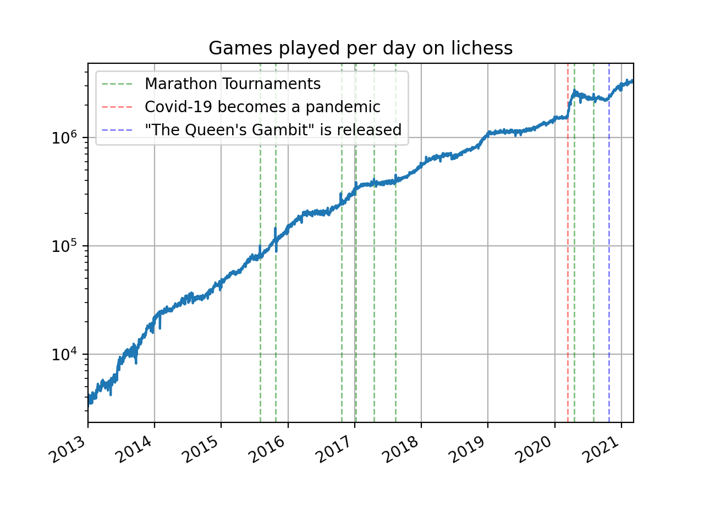

This repository was created to visualize the popularity and win rate of different chess openings over time. The [lichess database](https://database.lichess.org/#standard_games) was used.
## General popularity of Lichess in terms of the number of games played per day

It seems that usually, the main inflow happens in winters. Some spikes in the number of games played per day are associated with Marathon Tournaments.
